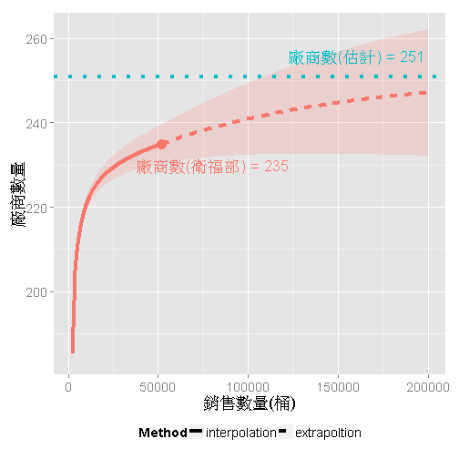

## Basic data exploration
將235家廠商之購買量排序發現為指數遞減關係，即強冠銷售的油品大多集中在少數幾間下游廠商。


```r
dat <- read.csv("manufacturer-list.csv")
dat <- within(dat, name <- factor(name, levels=name[order(-count)]))
dat <- dat[order(-dat$count, dat$region),]
head(dat)
```

```
     id    sn   name count region                              address
18  230 T1377   工研  4611 台北市 台北市信義區忠孝東路四段559巷38號2樓
121  42 N1101   台益  3738 桃園縣                桃園縣平鎮市新富街8號
153 111 S2141 金利華  2950 高雄市                高雄市前鎮區新大路5號
42  197 S4012   信益  2748 台南市             台南市長榮路五段４１９號
182  80 N3166   油蔥  1468 基隆市                    基隆市西定路139號
168 232 T1395   味全  1390 高雄市             高雄市路竹區中山南路51號
             phone Latitude Longitude
18    04-2407-8114    25.08     121.6
121     03-4598521    24.94     121.2
153     07-8111166    22.58     120.3
42         2515206    23.01     120.2
182   02-2428-2527    25.13     121.7
168 07-6962453#400    22.84     120.3
```

```r
library(ggplot2)
ggplot(dat, aes(x=1:length(count), y=count)) + geom_line(size=1) +
labs(x="廠商(依購買量排序)", y="數量(桶)") + theme(text=element_text(size=18))
```

 


## Pareto chart
進一步觀察Pareto chart發現前十大廠商之購買量佔總量的41%(共21216桶)。考慮到前二十大廠商時，購買量則增加到54% (美而美以600桶位居第17名)。


```r
dat$acum_norm <- cumsum(dat$count)
dat$acum_norm <- dat$acum_norm/3
lab3 <- paste(round(100*dat$acum_norm/max(dat$acum_norm)),"%",sep="")

ggplot(dat[1:10,]) + 
  geom_bar(aes(name, count), stat="identity") +
  geom_line(aes(name, acum_norm, group='1'), size=1, col="#F8766D") +
  geom_point(aes(name, acum_norm, group='1'), size=5, col="#F8766D") +
  geom_text(aes(name, acum_norm-300, label=lab3[1:10]), col="#F8766D") +
  geom_text(aes(x=8.5, y=5800, label="累進百分比"), col="#F8766D", hjust=0) +
  theme(text=element_text(size=18)) + labs(x="前十大廠商", y="數量(桶)", title="Top 10")
```

 


## Estimation of overall manufacturers
利用R套件[iNEXT](https://github.com/JohnsonHsieh/iNEXT) (Hseih, 2014) 可以進一步計算倘若黑心油事件沒有被揭發，隨著油品繼續販售額外會採用強冠油品的廠商估計會再增加16間，即251間。

註: 有興趣了解iNEXT與種類數估計的基本概念請參考[程式人2013-12月號](http://programmermagazine.github.io/201312/htm/article6.html)的介紹。


```r
library(devtools)
install_github("iNEXT", "JohnsonHsieh")
library(iNEXT)
out <- iNEXT(as.numeric(dat$count), size = seq(2000, 200000, length.out=200))
lab1 <- paste("廠商數(衛福部) =",out$BasicIndex[1,1])
lab2 <- paste("廠商數(估計) =",out$BasicIndex[1,2])
g <- ggiNEXT(out) + guides(colour=FALSE, fill=FALSE) +
  geom_hline(yintercept=out$BasicIndex[1,2], linetype=3, size=1.5, col="#00BFC4")
g + geom_text(x=80000, y=out$BasicIndex[1,1]-5, label=lab1, size=6) + 
  geom_text(x=160000, y=out$BasicIndex[1,2]+5, label=lab2, size=6, col="#00BFC4") +
  labs(x="銷售數量(桶)", y="廠商數量")
```
 


## GIS visualization 
最後利用google map API將各家廠商的地址轉換至經緯度觀察廠商的分布狀況，發現235家廠商散布在全台各個主要都市。其中前三名為高雄(11.5k)、台南(9.2k)、台北(5.4k)。


```r
library(ggmap)
map <- get_map(c(123,23.5), zoom=7, maptype = "terrain")
```

```
Map from URL : http://maps.googleapis.com/maps/api/staticmap?center=23.5,123&zoom=7&size=%20640x640&scale=%202&maptype=terrain&sensor=false
Google Maps API Terms of Service : http://developers.google.com/maps/terms
```

```r
# map <- get_googlemap(c(121, 23.5), maptype = "terrain", zoom=7)
ggmap(map, extent = "device", legend="topleft") + 
  xlim(c(119,123)) + ylim(c(21.5,25.5)) + 
  geom_point(data=dat, aes(x=Longitude, y=Latitude, size=count), 
             alpha=0.6, color="#C77CFF") +
  geom_text(data=dat[1:10,], aes(x=Longitude, y=Latitude, label=name), size=4) +
  scale_size_continuous(range=c(2,12)) + 
  guides(size=guide_legend("進貨數量")) +
  theme(text=element_text(size=12))
```

```
Scale for 'x' is already present. Adding another scale for 'x', which will replace the existing scale.
Scale for 'y' is already present. Adding another scale for 'y', which will replace the existing scale.
```

 

```r
library(reshape)
tab <- cast(data = dat, formula =  region~. , fun.aggregate = sum, value = "count")
tab[order(-tab[,2])[1:10],] # 依廠商所在地區排序進貨數量
```

```
   region (all)
18 高雄市 11539
5  台南市  9181
3  台北市  5422
17 桃園縣  4043
13 屏東縣  3525
22 新北市  3199
20 基隆市  2545
1  台中市  2265
15 苗栗縣  1541
12 屏東市   999
```

